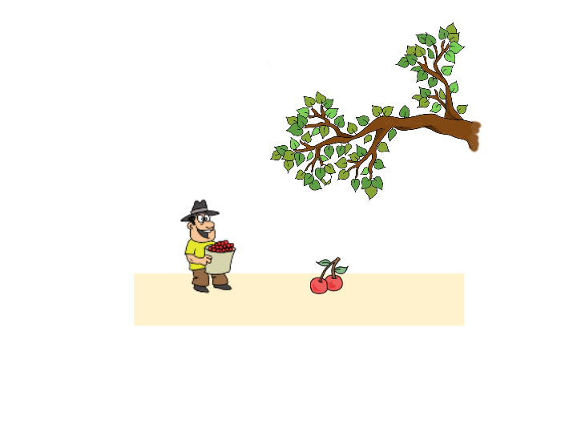
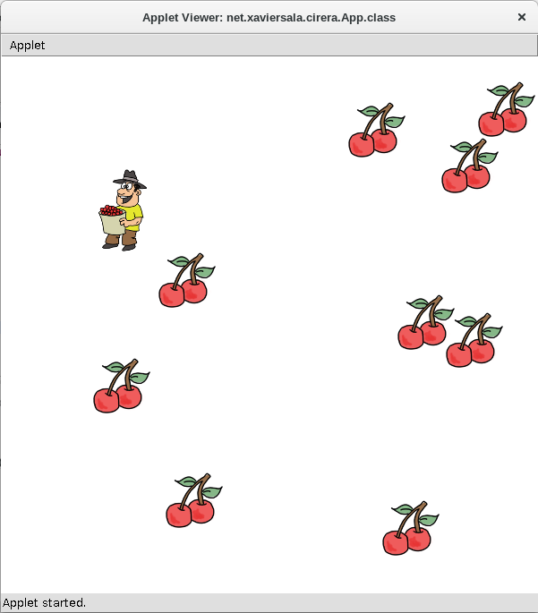

# cireraman
Programa per mostrar el funcionament d'un programa en ACM i alhora mostrar la idea de la orientació a Objectes (extremadament senzill però ...)

Programa
---------------
Un pagès de ciutat ha llogat un camp en el que hi cauen les cireres d’un cirerer que està en el camp del costat. Com que és un fanàtic de la propietat privada pensa *“cirera que cau en el meu camp, cirera que em quedo”*

Tot i així, per evitar conflictes amb el veí, ha decidit que recollirà totes les cireres tant ràpidament com pugui.

Activitat
-----------------
A recollir cireres que el món s’acaba

1. Es tracta de desenvolupar un programa que mostri on han aparegut les cireres dins del camp i permeti que l’usuari amb les tecles del cursos permetin al pagès de ciutat recollir-les

